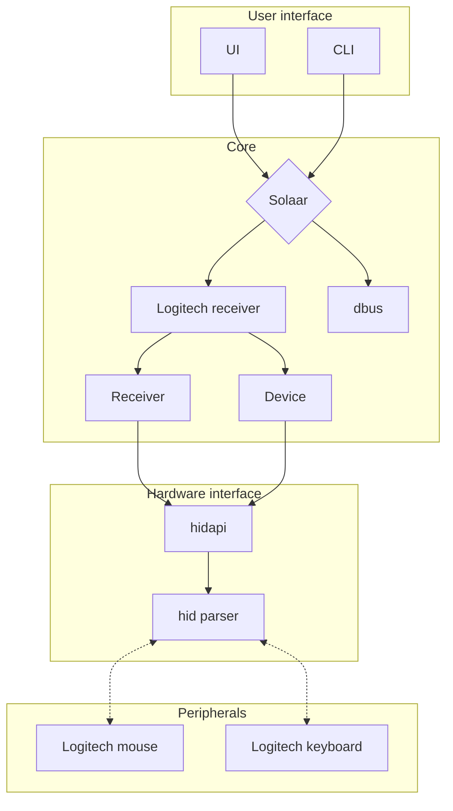

# Solaar Implementation

Solaar has three main components: code mostly about receivers and devices, code for the command line interface, and code for the graphical user interface.

The following graph shows the main components of Solaar and how they interact.



## Receivers and Devices

The code in `logitech_receiver` is responsible for creating and maintaining receiver (`receiver/Receiver`) and device (`device/Device`) objects for each device on the computer that uses the Logitech HID++ protocol.  These objects are discovered in Linux by interacting with the Linux `udev` system using code in `hidapi`.

The code in `logitech_receiver/receiver' is responsible for receiver objects.
...

The code in `logitech_receiver/device' is responsible for device objects.

... the complex device setup process

A device object stores the currrent value of many aspects of the device.  It provides methods for retrieving and setting these aspects.  The setters generally store the new value and call an hidpp10 or hidpp20 function to modify the device accordingly.  The retrievers generally check whether the value is cached on the device if so just returning the cached value and if not calling an hidpp10 or hidpp20 function to retrieve the value and returning the value after caching it.
...

Not all communication with a device is done through the `Device` class.    Some is done directly from settings.
....

### HID++

#### HID++ 2.0

The code in `logitech_receiver/hidpp20' interacts with devices using the HID++ 2.0 (and greater) protocol.  Many of the functions in this module send messages to devices to modify their internal state, for example setting a host name stored in the device.  Many other functions send messages to devices that query their internal state and interpret the response, for example returning how often a mouse sends movement reports.  The result of these latter functions are generally cached in device objects.

A few of these functions create and return a large structure or a class object.

The HID++ 2.0 protocol is built around a number of features, each with its own functionality.  One of the features, that is required to be implemented by all devices supporting the protocol, provide information on which features the device provides.  The `hidpp20` module provides a class (`FeaturesArray`) to store information on what features are provided by a device and how to access them.  Each device that implements the HID++ 2.0 protocol has an instance of this class.  The heavily used function `feature_request` creates an HID++ 2.0 message using this information to help determine what data to put into the message.

Many devices allow reprogramming some keys or buttons.  One the main reasons for reprogramming a key or device is to cause it to produce an HID++ message instead of its normal HID message, this is referred to as diverting the key (to HID++).  The `ReprogrammableKey` class stores information about the reprogramming of one key for one version of this capability, with methods to access and update this information.  The `PersistentRemappableAction` class does the same for another version.  The `KeysArray` class stores information about the reprogramming of a collection of keys, with methods to access this information.  Functions in the Device class request `KeysArray` information for a device when appropriate and store it on the device.

Many pointing devices provide a facility for recognizing gestures and sending an HID message for the gesture.  The `Gesture` class stores inforation for one gesture and the `Gestures` class stores information for all the gestures on a device.  Functions in the Device class request `KeysArray` information and store it on devices.  Functions in the Device class request `Gestures` information for a device when appropriate and store it on the device.

Many gaming devices provide an interface to controlling their LEDs by zone.  The `LEDEffectSetting` class stores the current state of one zone of LEDs.   This information can come directly from an LED feature but is also part of device profiles so this class provides a byte string interface.   Solaar stores this information in YAML so this class provides a YAML interface.   The `LEDEffectsInfo` class stores information about what LED zones are on a device and what effects they can perform and provides a method that builds an object by querying a device.

Many gaming devices can be controlled by selecting one of their profiles.  A profile sets up the rate at which the device reports movement, a set of sensitivites of its movement detector, a set of actions to be performed by mouse buttons or G and M keys, and effects for up to two LED zones.  The `Button` class stores information about a button or key action.  The `OnboardProfile` class stores a single profile, using the `LEDEffectSetting` and `Button` classes.  Because retrieving and changing a profile is complex, this class provides a byte string interface.  Because Solaar dumps profiles from devices as YAML documents and loads them into devices from YAML documents, this class provides a YAML interface.  The `OnboardProfiles` class class stores the entire profiles information for a device.  It provides an interface to construct an `OnboardProfiles` object by querying a device.
Because Solaar dumps profiles from devices as YAML documents and loads them into devices from YAML documents, these classes also provide a YAML interface.

#### HID++ 1.0

The code in `logitech_receiver/hidpp10' interacts with devices using the HID++ 1.0 protocol.

...

### Low Level Information and Access

The module `descriptors` sets up information on device models for which Solaar needs information to support.  Solaar can determine all this information for most modern devices so it is only needed for older devices or devices that are unusual in some way.  The information may include the name of the device model, short name of the device model, the HID++ protocol used by the device model, HID++ registers supported by the device model, various identifiers for the device model, and the USB interface that the device model uses for HID++ messages.  It used to include the HID++-based settings for the device model but this information is now added in `setting_templates`.  The information about a device model can be retrieved in several ways.


The module `base_usb` sets up information for most of the receiver models that Solaar supports, including USB id, USB interface used for HID++ messages, what kind of receiver model it is, and some capabilities of the receiver model.  Solaar can now support other receivers as long as they are not too unusual.  The module lso sets up lists of device models by USB ID and Bluetooth ID and provides a function to determine whether a USB ID or Bluetooth ID is an HID++ device model

The module `base` provides functions that call discovery to enumerate all current receivers and devices and to set up a callback for when new receivers or devices are discovered.  It provides functions to open and close I/O channels to receivers and devices, write HID++ messages to receivers and devices, and read HID++ messages from receivers and devices.  It provides a function to turn an HID++ message into a notification.

The module provides a function to send an HID++ message to a receiver or device, constructing the message from parameters to the function, and optionally waiting for and returning a response.  The function checks messages from the receiver or device, only terminating at timeout or when a message that appears to be the response is seen.  Other messages are turned into notifications if appropriate and ignoreed otherwise.  A separate function sends a ping message and waits for a reply to the ping.


### Notifications and Status

HID++ devices not only respond to commands but can spontaneously emit HID++ messages, such as when their movement sensitivity changes or when a diverted key is pressed.  These spontaneous messages are called notifications and if software is well behaved can be distinguished from messages that are responses to commands.  (The Linux HIDPP driver was not well behaved at some time and still may not be well behaved, resulting in it causing devices to send responses that cannot be distinguished from notifications.)

The `listener` module provides a class to set up a thread that listens to all the HID++ messages that come from a given device or receiver, convert the message that are notifications to a Solaar notification structure, and invoke a callback on the notification.

The 'notifications` module provides a function to take a notification from a receiver or device and initiate processing required for that notification.  For receivers notifications are used to signal the progress of pairing attempts.  For devices some notifications are for pairing, some signal device connection and diconnection from a receiver, some are other parts of the HID++ 1.0 protocol, and some are for the HID++ 2.0 protocol.  Devices can provide a callback for special handling of notifications.  This facility is used for two special kinds of Solaar settings.

The module contains code that determines the meaning of a notification based on fields in the notification and the status and HID++ 2.0 features of the device if appropriate and updates the device and its status accordingly.  Updates to device status can trigger updates to the Solaar user interface.  The processing of some notifications also directly runs a function to update the Solaar user interface.

After this processing HID++ 2.0 notifications are sent to the `diversion` module where they initiate Solaar rule processing.

The `status` module provides the `DeviceStatus` class to record the battery status of a device.  It also provides an interface to signal changes to the connection status of the device that can invoke a callback.  This callback is used to update the Solaar user interface when the status changes.


### Settings

The Solaar GUI is based around settings.
A setting contains all the information needed to store the value of some aspect of a device, read it from the device, write it to the device, and record its state in a dictionary.  A setting also contains information to display and manipulate a setting, namely what kind of user interface element to use, what values are permissable, a label to use for the setting, and a tooltip to provide additional information for the setting.  Settings can be either based on HID++ 1.0, using an HID++ 1.0 register that the device provides, or based on HID++ 2.0, using an HID++ 2.0 feature that the device provides.  The module `settings` provides classes and methods to create and support a setting.  The module `setting_templates` contains all the settings that Solaar supports as well as functions to determine what feature-based settings a device can support.

A simple boolean setting can be set up as follows:
```
class HiresSmoothInvert(_Setting):
    name = 'hires-smooth-invert'
    label = _('Scroll Wheel Direction')
    description = _('Invert direction for vertical scroll with wheel.')
    feature = _F.HIRES_WHEEL
    rw_options = {'read_fnid': 0x10, 'write_fnid': 0x20}
    validator_options = {'true_value': 0x04, 'mask': 0x04}
```
The setting is a boolean setting, the default for settings.
`name` is the dictionary key for recording the state of the setting.
`label` is the label to be shown for the setting in a user interface and `description` is the tooltip.
`feature` is the HID++ 2.0 feature that is used to read the current state of the setting from a device and write it back to a device.
`rw_options` contains options used when reading or writing the state of the setting, here to use feature command 0x10 to read the value and feature command 0x20 to write the value.
`validator_options` contains options to turn setting values into bytes and bytes into setting values. The options here to take a single byte (the default) and mask it with 0x04 to get a value with a result of 0x04 being true and anything else being false.  They also say to use 0x04 when writing a true value and 0x00 (the default) when writing a false value.  Because this is a boolean setting and the mask masks off part of a byte the value to be written is or'ed with the byte read for the setting before writing to the device.

A simple choice setting can be set up as follows:
```
class Backlight(_Setting):
    name = 'backlight-qualitative'
    label = _('Backlight')
    description = _('Set illumination time for keyboard.')
    feature = _F.BACKLIGHT
    choices_universe = _NamedInts(Off=0, Varying=2, VeryShort=5, Short=10, Medium=20, Long=60, VeryLong=180)
    validator_class = _ChoicesV
    validator_options = {'choices': choices_universe}
```
This is a choice setting because of the value for `validator_class`.
`choices_universe` is all the possible stored values for the setting along with how they are to be displayed in a user interface.
`validator_options` provides the current permissable choices, here always are the same as all the choices.

The Solaar GUI takes these settings and constructs an interface for displaying and changing the setting.

This setup allows for very quick implementation of simple settings but it bypasses the data stored in a device object.


### Solaar Rules

The `diversion` module (so-named because it initially mostly handled diverted key notifications) implements Solaar rules.

...


### Utility Functions, Structures, and Classes

The module `common.py` provides utility functions, structures, and classes.
`crc16` is a function to compute checksums used in profiles.
`NamedInt`, `NamedInts`, and `UnsortedNamedInts` provide integers and sets of integers with attached names.
`FirmwareInfo` provides information about device firmware.
`BATTERY_APPROX` provides named integers used for approximate battery levels of devices.

`i18n.py` provides a few strings that need translations and might not otherwise be visible to translation software.

`special_keys.py` provides named integers for various collections of key codes and colors.


## Discovery of HID++ Receivers and Devices and I/O

The code in `hidapi` is responsible for discovery of receivers and devices that use the HID++ protocol.   The module used in Linux is `hidapi/udev` which is a modification of some old Python code that provides an interface to the Linux `udev` system.

The code originally was only for receivers that used USB and devices paired with them.  It identifies HID++ receivers by their USB ids, based on a list of Logitech HID++ receivers with their USB ids.  It then added all devices that were paired with them and that were in a list of HID++ devices with their WPID.  A WPID is used to identify the device type for devices paired with HID++ receivers.  This code now also adds all devices paired with HID++ receivers whether they are in this list or not.

The code now also identifies HID ++ devices that are directly connected via either USB or Bluetooth.  These devices are recognized by several means: the internal list of HID++ devices for elements of the list that have either a USB IS or a Bluetooth ID, any device with a USB ID or Bluetooth ID that falls in one of several ranges of IDs that are known to support HID++, or any device that has an HID protocol descriptor that claims support for HID++.  This last method requires an external Pyshon module to decipher HID protocol descriptors that is not always present.

Device and receiver discovery is performed when Solaar starts.  While the Solaar GUI is running the `udev` code also listens for connections of new hardware using facilities from `GLib`.

This code is also responsible for actual writing data to devices and receivers and reading data from them.


## Solaar

### Startup and Commonalities

__init__.py
configuration.py
gtk.py*
i18n.py
listener.py
tasks.py
upower.py

The files `version` and `commit` contain data about the current version and git commit of Solaar.

### Solaar Command Line Interface

solaar/cli

### Solaar (Graphical) User Interface

solaar/ui
