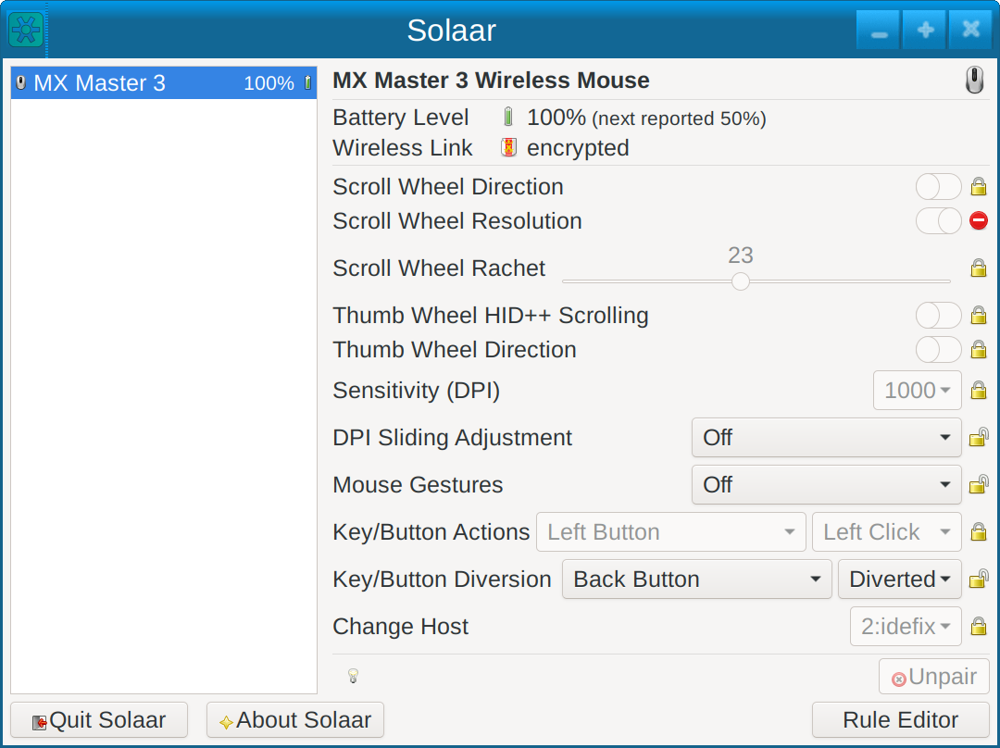
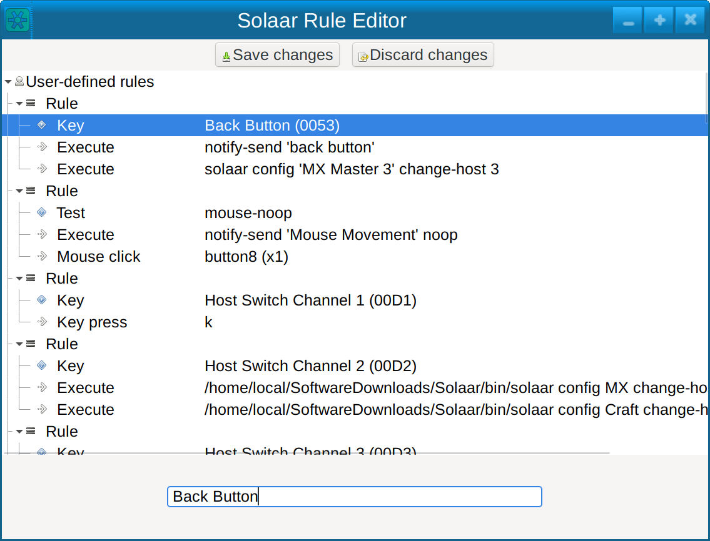

Rule processing is an experimental feature.  Significant changes might be made in response to problems.

Note that rule processing only fully works under X11.
When running under Wayland with X11 libraries loaded most features will not be available and errors may result.
Features known not to work under Wayland include process conditions and
anything to do with simulating keyboard or mouse input.

Logitech devices that use HID++ version 2.0 or greater produce feature-based
notifications that Solaar can process using a simple rule language.  For
example, using rules Solaar can emulate an `XF86_MonBrightnessDown` key tap
in response to the pressing of the `Brightness Down` key on Craft keyboards,
which normally does not produce any input at all when the keyboard is in
Windows mode.

Solaar's rules only trigger on HID++ notifications so device actions that
normally produce HID output need rule processing have to be first be set to
produce HID++ notifications instead of their normal behavior (diverted).
Currently Solaar can divert some mouse scroll wheels, some
mouse thumb wheels, the crown of Craft keyboards, and some keys and buttons.
If the scroll wheel, thumb wheel, crown, key, or button is
not diverted by setting the appropriate setting then no HID++ notification is
generated so rules will not be triggered by manipulating the wheel, crown, key, or button.
Look for `HID++` or `Diversion` settings to see what
diversion can be done with your devices.

Running Solaar with the `-dd`
option will show information about notifications, including their feature
name, report number, and data.

Solaar can also create special notifications in response to mouse movements on some mice.
Setting the `Mouse Gestures` setting to a key enables special processing of mouse movements
while the key is depressed.  Moving the mouse creates a mouse movement event.
Stopping the mouse for a little while and moving it again creates another mouse movement event.
Pressing a diverted key creates a key event.
When the key is released the sequence of events is sent as a synthetic notification
that can be matched with `Mouse Gesture` conditions.

In response to a feature-based HID++ notification Solaar runs a sequence of
rules.  A `Rule` is a sequence of components, which are either sub-rules,
conditions, or actions.  Conditions and actions are dictionaries with one
entry whose key is the name of the condition or action and whose value is
the argument of the action.

If the last thing that a rule does is execute an action, no more rules are
processed for the notification.

Rules are evaluated by evaluating each of their components in order.  The
evaluation of a rule is terminated early if a condition component evaluates
to false or the last evaluated sub-component of a component is an action.  A
rule is false if its last evaluated component evaluates to a false value.

`Not` conditions take a single component and are true if their component
evaluates to a false value.
`Or` conditions take a sequence of components and are evaluated by
evaluating each of their components in order.
An Or condition is terminated early if a component evaluates to true or the
last evaluated sub-component of a component is an action.
A Or condition is true if its last evaluated component evaluates to a true
value.  `And` conditions take a sequence of components are evaluted the same
as rules.

`Process` conditions are true if the process for focus input window
or the window's Window manager class or instance name starts with their string argument.
`MouseProcess` conditions are true if the process for the window under the mouse
or the window's Window manager class or instance name starts with their string argument.
`Feature` conditions are if true if the name of the feature of the current
notification is their string argument.
`Report` conditions are if true if the report number in the current
notification is their integer argument.
`Modifiers` conditions take either a string or a sequence of strings, which
can only be `Shift`, `Control`, `Alt`, and `Super`.
Modifiers conditions are true if their argument is the current keyboard
modifiers.
`Key` conditions are true if the Logitech name of the last diverted key or button down is their
string argument.  Alternatively, if the argument is a list `[name, action]` where `action`
is either `'pressed'` or `'released'`, the key down or key up events of `name` argument are
matched, respectively.  Logitech key and button names are shown in the `Key/Button Diversion`
setting.  Some keyboards have Gn keys, which are diverted using the 'Divert G Keys' setting.
`Test` conditions are true if their test evaluates to true on the feature,
report, and data of the current notification.
Test conditions can return a number instead of a boolean.

Test conditions consisting of a sequence of three or four integers use the first
two to select bytes of the notification data.
Writing this kind of test condition is not trivial.
Three-element test conditions are true if the selected bytes bit-wise anded
with its third element is non-zero.
The value of these test conditions is the result of the and.
Four-element test conditions are true if the selected bytes form a signed
integer between the third and fourth elements.
The value of these test condition is the signed value of the selected bytes
if that is non-zero otherwise True.

The other test conditions are mnemonic shorthands for meaningful feature,
report, and data combinations in notifications.
A `crown_right` test is the rotation amount of a `CROWN` right rotation notification.
A `crown_left` test is the rotation amount of a `CROWN` left rotation notification.
A `crown_right_ratchet` test is the ratchet amount of a `CROWN` right ratchet rotation notification.
A `crown_left_ratchet` test is the ratchet amount of a `CROWN` left ratchet rotation notification.
A `crown_tap` test is true for a `CROWN` tap notification.
A `crown_start_press` test is true for the start of a `CROWN` press notification.
A `crown_stop_press` test is true for the end of a `CROWN` press notification.
A `crown_pressed` test is true for a `CROWN` notification with the Crown pressed.
A `thumb_wheel_up` test is the rotation amount of a `THUMB WHEEL` upward rotation notification.
A `thumb_wheel_down` test is the rotation amount of a `THUMB WHEEL` downward rotation notification.
`lowres_wheel_up`, `lowres_wheel_down`, `hires_wheel_up`, `hires_wheel_down` are the
same but for `LOWRES WHEEL` and `HIRES WHEEL`.
`True` and `False` tests return True and False, respectively.

`Mouse Gesture` conditions are true if the actions taken while the mouse's 'Gesture' button is held match the configured list when the 'Gesture' button is released.
The available actions are `Mouse Up`, `Mouse Down`, `Mouse Left`, `Mouse Right`, `Mouse Up-left`, `Mouse Up-Right`, `Mouse Down-left`, `Mouse Down-right`, and buttons that are diverted.
An example would be mapping `Mouse Up` -> `Mouse Up`. To perform this gesture, you would hold down the 'Gesture' button, move the mouse upwards, pause momentarily, move the mouse upwards, and release the 'Gesture' button.
Another example would be mapping `Back Button` -> `Back Button`. With this one, you would hold down the 'Gesture' button, double-tap the 'Back' button, and then release the 'Gesture' button.
Mouse movements and buttons can be mixed and chained together however you like.
It's possible to create a `No-op` gesture by clicking 'Delete' on the initial Action when you first create the rule. This gesture will trigger when you simply click the 'Gesture' button.

A `KeyPress` action takes a sequence of X11 key symbols and simulates a chorded keypress on the keyboard.
Any key symbols that correspond to modifier keys that are in the current keyboard modifiers are ignored.
A `MouseScroll` action takes a sequence of two numbers and simulates a horizontal and vertical mouse scroll of these amounts.
If the previous condition in the parent rule returns a number the scroll amounts are multiplied by this number.
A `MouseClick` action takes a mouse button name (`left`, `middle` or `right`) and a positive number, and simulates that number of clicks of the specified button.
An `Execute` actions takes a program and arguments and executes it asynchronously.

Solaar has several built-in rules, which are run after user-created rules and so can be overridden by user-created rules.
One rule turns
`Brightness Down` key press notifications into `XF86_MonBrightnessDown` key taps
and `Brightness Up` key press notifications into `XF86_MonBrightnessUp` key taps.
Another rule makes Craft crown ratchet movements move between tabs when the crown is pressed
and up and down otherwise.
A third rule turns Craft crown ratchet movements into `XF86_AudioNext` or `XF86_AudioPrev` key taps when the crown is pressed and `XF86_AudioRaiseVolume` or `XF86_AudioLowerVolume` otherwise.
A fourth rule doubles the speed of `THUMB WHEEL` movements unless the `Control` modifier is on.
All of these rules are only active if the key or feature is diverted, of course.

Solaar reads rules from a YAML configuration file (normally `~/.config/solaar/rules.yaml`).
This file contains zero or more documents, each a rule.

Here is a file with four rules:

```
%YAML 1.3
---
- MouseGesture: [Mouse Up, Mouse Down]
- Execute: xflock4
...
- Feature: CROWN
- Process: quodlibet
- Rule: [ Test: crown_start_press, KeyPress: XF86_AudioMute ]
- Rule: [ Test: crown_pressed, Test: crown_right_ratchet, KeyPress: XF86_AudioNext ]
- Rule: [ Test: crown_pressed, Test: crown_left_ratchet, KeyPress: XF86_AudioPrev ]
- Rule: [ Test: crown_right_ratchet, KeyPress: XF86_AudioRaiseVolume ]
- Rule: [ Test: crown_left_ratchet, KeyPress: XF86_AudioLowerVolume ]
...
---
- Feature: THUMB WHEEL
- Rule: [ Modifiers: Control, Test: thumb_wheel_up, MouseScroll: [-2, 0] ]
- Rule:
  - Modifiers: Control
  - Test: thumb_wheel_down
  - MouseScroll: [-2, 0]
- Rule: [ Or: [ Test: thumb_wheel_up, Test: thumb_wheel_down ], MouseScroll: [-1, 0] ]
...
---
- Feature: LOWRES WHEEL
- Rule: [ Or: [ Test: lowres_wheel_up, Test: lowres_wheel_down ], MouseScroll: [0, 2] ]
...
```

Here is an example showing how to divert the Back Button on an MX Master 3 so that pressing
the button will initiate rule processing and a rule that triggers on this notification and
switches the mouse to host 3 after popping up a simple notification.




