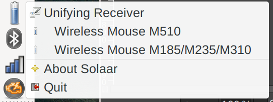
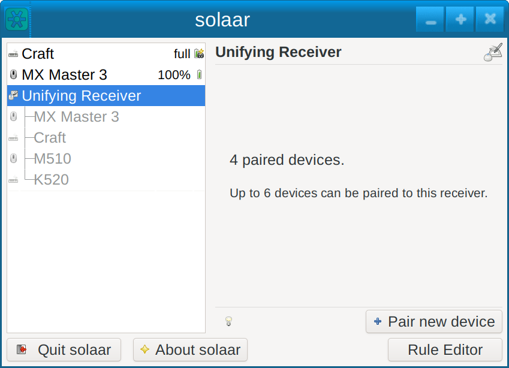
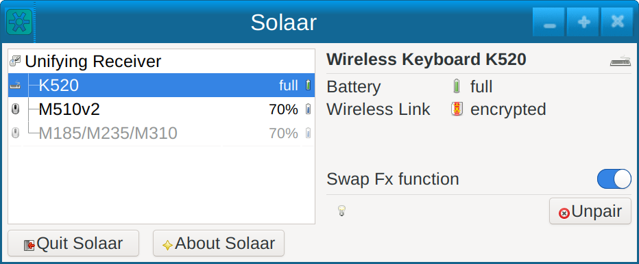
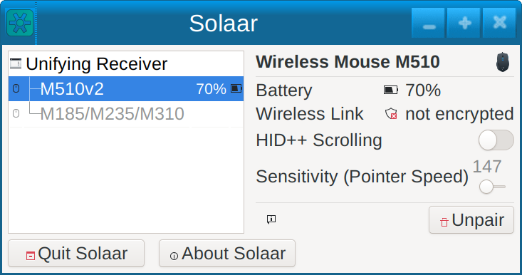
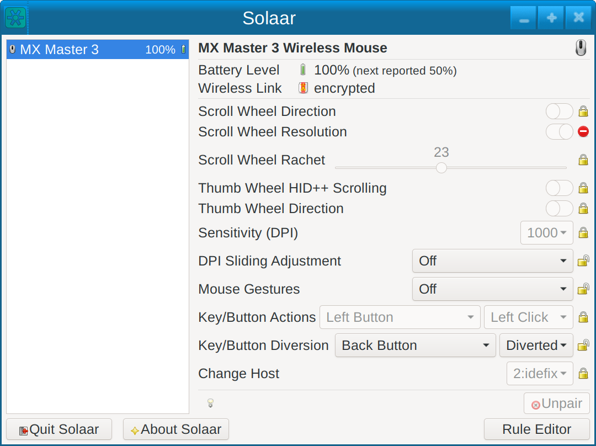
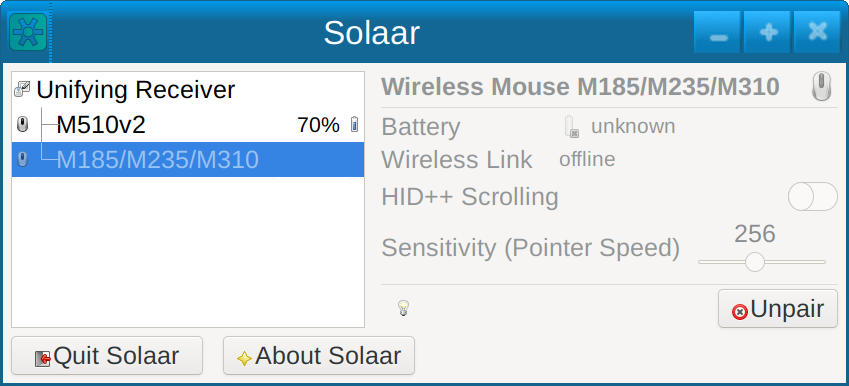
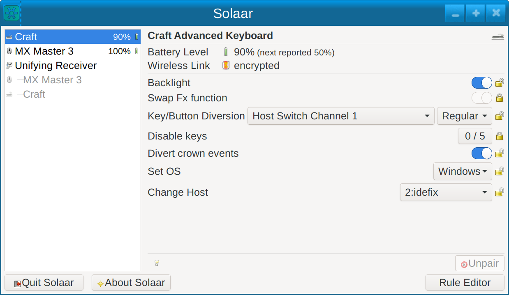
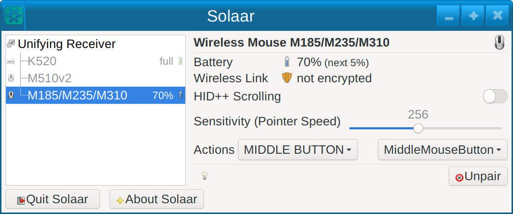

# Solaar GUI Usage

The Solaar GUI (the usual way to run Solaar) is meant to run continuously in the background,
monitoring devices, making changes to them, and responding to some messages they emit.
The Solaar GUI normally creates an icon in your system tray that provides an interface
to Solaar.  This icon is
usually a battery icon showing the approximate battery level for your device
with the lowest known battery level. If there are no devices with battery information,
then the icon is one of the Solaar icons.

Solaar also has a main window.  When the main window is invisible,
click on Solaar's icon in the system tray to bring up the Solaar menu, and then
click on a receiver or device in the menu to see information about
that receiver or device.

The following is an image of the Solaar menu and the icon (the battery
symbol is in the system tray at the left of the image). The icon can
also be other battery icons or versions of the Logitech Unifying icon.

Clicking on “Quit” in the Solaar menu terminates the program.
Clicking on “About Solaar” pops up a window with further information about Solaar.

## Solaar options

There are several options that affect how the Solaar GUI behaves:

* `--help` shows a help message and then quits
* `--version` shows the version of Solaar and then quits
* `--window=show` starts Solaar with the main window showing
* `--window=hide` starts Solaar with the main window not showing
* `--window=only` starts Solaar with no system tray icon and the main window showing
* `--battery-icons=regular` uses regular icons for battery levels
* `--battery-icons=symbolic` uses symbolic icons for battery levels
* `--battery-icons=solaar` uses only the Solaar icon in the system tray

## Solaar main window

The Solaar main window shows your Logitech receivers and devices that Solaar
knows about and can be used to pair new devices, unpair paired devices, and
view and change some settings of the selected receiver or device.
To select a receiver or device click on it in the left side of the window.

Closing the main window does not terminate Solaar (unless Solaar is not using the system tray).
Clicking on “Quit Solaar” terminates the program, and “About Solaar” pops up a window with further information.
The light bulb (or a similar icon) displays detailed information
about the selected receiver or device (useful for debugging).

### Pairing and unpairing devices

When a receiver is selected in the main window, you can pair a new device by
clicking on the “Pair new device” button.
Then turn on the device and it should pair with the receiver if that is possible
and the device is not already paired with another active receiver.
For multi-host devices first select the host position that you want.
Bolt devices and some Lightspeed devices pair by pressing a special pairing button.
To pair with a Bolt receiver you have to type a passcode followed by enter
or click the left and right buttons in the correct sequence followed by
clicking both buttons simultaneously.

When a device is selected you can unpair the device if your receiver supports
unpairing. To unpair the device, just click on the “Unpair” button and
confirm in the window that pops up.

A receiver with the Unifying logo should be able to pair with any device
with the Unifying logo
and a receiver with the Bolt logo should be able to pair with any device
with the Bolt logo.
If there are no open pairing slots, however, you will
not be able to pair a new device. In this case to pair a new device you
first need to unpair a device.

Other receivers can only pair with certain kinds of devices.
Most of these receivers do not allow unpairing - instead
pairing a new device replaces an existing paired device of the same kind.
Some receivers can only pair a limited number of times.

### Viewing and changing device settings

When a device is selected you can see the approximate battery level of the
device, if that is reported by the device, and the status of the link
between the device and its receiver.

You can also see and change the settings of devices.
Changing settings is performed by clicking on buttons,
moving sliders, or selecting from alternatives.

Device settings now have a clickable icon that determines whether the
setting can be changed and whether the setting is ignored.

If the selected device that is paired with a receiver is powered down or
otherwise disconnected its settings cannot be changed
but it still can be unpaired if its receiver allows unpairing.

If a device is paired with a receiver but directly connected via USB or Bluetooth
the receiver pairing will show up as well as the direct connection.
The device can only be manipulated using the direct connection.

#### Remapping key and button actions

For many devices Solaar can remap some of their keys or buttons to
perform a different action. (This changes the information that the
device sends when the key or button is activated.) Only some keys on some
devices can be remapped and they can only be remapped to a limited
number of actions. The remapping is done by selecting a key
or button in the left-hand box on the “Action” setting line and then
selecting the action to be performed in the right-hand box. The default
action is always the one shown first in the list. As with all settings,
Solaar will remember past action settings and restore them on the device
from then on.

The names of the keys, buttons, and actions are mostly taken from Logitech
documentation and may not be completely obvious.

It is possible to end up with an unusable system, for example by having no
way to do a mouse left click, so exercise caution when remapping keys or
buttons that are needed to operate your system.

## Solaar command-line interface

Solaar also has a command-line interface that can do most of what can be
done using the main window. For more information on the
command line interface, run `solaar --help` to see the commands and
then `solaar <command> --help` to see the arguments to any of the commands.

## Solaar settings

Solaar supports at least the following settings:

Setting                          | Description
---------------------------------|------------
Hand Detection			 | Turn on backlight when your hands hover over the keyboard
Scroll Wheel Smooth Scrolling	 | Higher-speed vertical scrolling
Side Scrolling	    		 | When off, side scrolling sends custom button events
Scroll Wheel High Resolution	 | Higher-speed vertical scrolling
Scroll Wheel HID++ Scrolling	 | When on, vertical scrolling uses HID++ events
Scroll Wheel Direction		 | Reverse direction of vertical scrolling
Scroll Wheel Resolution		 | Higher-speed vertical scrolling (use with caution)
Scroll Wheel Rachet		 | Shift wheel ratchet on and off based on wheel speed
Thumb Wheel HID++ Scrolling	 | When on, thumb-wheel scrolling uses HID++ events
Thumb Wheel Direction		 | Reverse direction of thumb-wheel scrolling
Sensitivity (DPI)		 | Mouse movement sensitivity
Sensitivity (Pointer Speed)	 | Mouse movement sensitivity
Backlight   			 | Turn on backlight
Swap Fx function		 | Change Fn keys to normally do their special action
DPI Sliding Adjustment		 | Change Sensitivity (DPI) by holding a button and moving the mouse
Mouse Gestures			 | Create HID++ events by holding a button and moving the mouse
Key/Button Actions   		 | Change what a key or button does
Key/Button Diversion		 | Divert keys and buttons to create HID++ events
Divert crown events		 | Divert crown actions to create HID++ events
Divert G Keys			 | Divert G keys to create HID++ events
Disable keys			 | Disable one or more keys
Set OS				 | Change keys to match OS
Change Host			 | Connect to a different host
Gestures			 | Turn on and off various (mostly touchpad) gestures
Gesture params			 | Modify parameters for gestures

HID++ events are mostly not processed by Linux input drivers.
Settings that involve sending HID++ events exist so that these events can be
processed by Solaar rules instead of by Linux.

Different Logitech devices may implement the same functionality in different ways,
thus the different settings that do the same thing.
