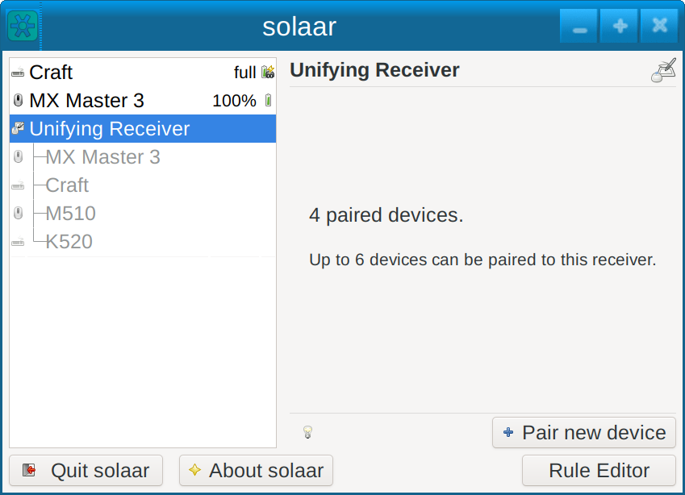

# Solaar usage

Under normal usage Solaar creates an icon in your system tray.  This icon is
usually a battery icon showing the approximate battery level for your device
with the lowest known battery level.  If there is no battery information to
show the icon is one of the Solaar icons.

Solaar also has a main window.  To show the main window if it is not visible
click on the icon in the system tray to bring up the Solaar menu and then
click on a receiver or device in the menu.

Here is an example of the Solaar icon (in the system tray) and the Solaar menu:

Clicking on "Quit" in the Solaar menu terminates Solaar.
Clicking on "About Solaar" pops up a window with information on Solaar.

## Solaar options

There are several options that affect how Solaar behaves:

* `--help` shows a help message and then quits
* `---window=show` starts Solaar with the main window showing
* `---window=hide` starts Solaar with the main window not showing
* `---window=only` starts Solaar with no system tray icon and the main window showing
* `--battery-icons=symbolic` uses symbolic icons for battery levels

## Solaar main window

The Solaar main window shows your Logitech receivers and devices that Solaar
knows about and can be used to pair new devices, unpair paired devices, and
view and change some settings of the selected receiver or device.
To select a receiver or device click on it in the left side of the window.

Closing the main window does not terminate Solaar (unless Solaar is not using the system tray).
Clicking on "Quit Solaar" terminates Solaar.
Clicking on "About Solaar" pops up a window with information on Solaar.
Clicking on the lightbulb (or similar icon) displays detailed information
about the selected receiver or device (mostly only useful for debugging).

When a receiver is selected in the main window you can pair a new device by
clicking on the "Pair new device" button.
Then turn on the device and it should pair with the receiver if that is possible.

Some receivers can only pair with certain kinds of devices.  Some receivers
pair a new device by replacing an existing paired device of the same kind.
Some receivers can only pair a limited number of times.
A receiver with the Unifying logo should be able to pair with any device
with the Unifying logo.  If there are no open pairing slots, however, you may
not be able to pair a new device.  In this case to pair a new device you
first need to unpair a device.

When a device is selected you can unpair the device if your receiver supports
unpairing.  To unpair the device, just click on the "Unpair" button and
confirm in the window that pops up.

When a device is selected you can see the approximate battery level of the
device, if that is reported by the device, and the status of the link
between the device and its receiver.
You can also see some settings of the device and change
some of these.  Changing settings is performed by clicking on buttons or
moving sliders.

If the selected device is off or otherwise disconnected its settings cannot be changed
but it still can be unpaired if its receiver allows unpairing.

## Solaar command line interface

Solaar also has a command line interface that can do most of what can be
done using the Solaar main window.  For more information on the Solaar
command line interface, run `solaar --help` to see the Solaar commands and
then `solaar <command> --help` to see the arguments to any of the commands.

